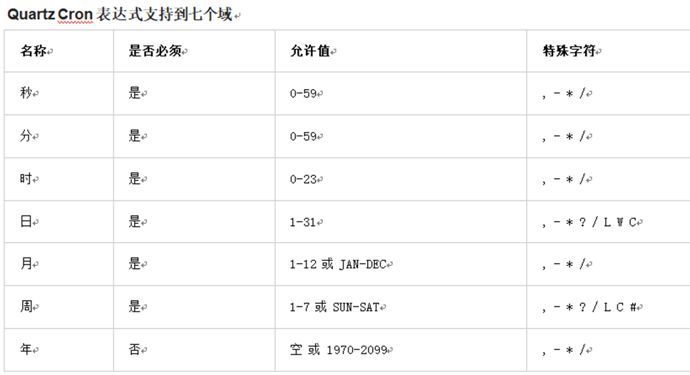
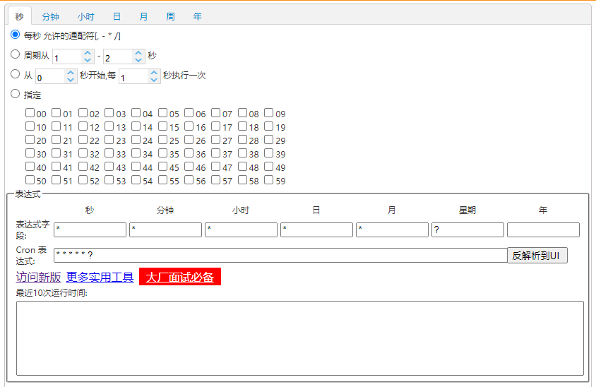

    <h1>
        定时任务组件Quartz
    </h1>

## 1 Quartz介绍

Quartz是Job scheduling（作业调度）领域的一个开源项目，Quartz既可以单独使用也可以跟spring框架整合使用，在实际开发中一般会使用后者。使用Quartz可以开发一个或者多个定时任务，每个定时任务可以单独指定执行的时间，例如每隔1小时执行一次、每个月第一天上午10点执行一次、每个月最后一天下午5点执行一次等。

官网：http://www.quartz-scheduler.org/

maven坐标：

~~~xml
<dependency>
  <groupId>org.quartz-scheduler</groupId>
  <artifactId>quartz</artifactId>
  <version>2.2.1</version>
</dependency>
<dependency>
  <groupId>org.quartz-scheduler</groupId>
  <artifactId>quartz-jobs</artifactId>
  <version>2.2.1</version>
</dependency>
~~~

## 2 Quartz入门案例

本案例基于Quartz和spring整合的方式使用。具体步骤：

（1）创建maven工程quartzdemo，导入Quartz和spring相关坐标，pom.xml文件如下

~~~xml
<?xml version="1.0" encoding="UTF-8"?>
<project xmlns="http://maven.apache.org/POM/4.0.0"
         xmlns:xsi="http://www.w3.org/2001/XMLSchema-instance"
         xsi:schemaLocation="http://maven.apache.org/POM/4.0.0 http://maven.apache.org/xsd/maven-4.0.0.xsd">
    <modelVersion>4.0.0</modelVersion>
    <groupId>com.itheima</groupId>
    <artifactId>quartdemo</artifactId>
    <version>1.0-SNAPSHOT</version>
    <dependencies>
        <dependency>
            <groupId>org.springframework</groupId>
            <artifactId>spring-context-support</artifactId>
            <version>5.0.2.RELEASE</version>
        </dependency>
        <dependency>
            <groupId>org.springframework</groupId>
            <artifactId>spring-tx</artifactId>
            <version>5.0.2.RELEASE</version>
        </dependency>
        <dependency>
            <groupId>org.quartz-scheduler</groupId>
            <artifactId>quartz</artifactId>
            <version>2.2.1</version>
        </dependency>
        <dependency>
            <groupId>org.quartz-scheduler</groupId>
            <artifactId>quartz-jobs</artifactId>
            <version>2.2.1</version>
        </dependency>
    </dependencies>
</project>
~~~

（2）自定义一个Job

~~~java
package com.itheima.jobs;
/**
 * 自定义Job
 */
public class JobDemo {
    public void test() {
        String time = DateTimeFormatter.ofPattern("yyyy-MM-dd HH:mm:ss").format(LocalDateTime.now());
        System.out.println("\n***************************" +
                           "\n" +
                           "\n\r\r\rscheduler " + time +
                           "\n" +
                           "\n***************************\n\n");
    }
}
~~~

（3）提供Spring配置文件spring-jobs.xml，配置自定义Job、任务描述、触发器、调度工厂等

~~~xml
<?xml version="1.0" encoding="UTF-8"?>
<beans xmlns="http://www.springframework.org/schema/beans"
       xmlns:xsi="http://www.w3.org/2001/XMLSchema-instance"
       xmlns:context="http://www.springframework.org/schema/context"
       xmlns:dubbo="http://code.alibabatech.com/schema/dubbo"
       xmlns:mvc="http://www.springframework.org/schema/mvc"
       xsi:schemaLocation="http://www.springframework.org/schema/beans
						http://www.springframework.org/schema/beans/spring-beans.xsd
						http://www.springframework.org/schema/mvc
						http://www.springframework.org/schema/mvc/spring-mvc.xsd
						http://code.alibabatech.com/schema/dubbo
						http://code.alibabatech.com/schema/dubbo/dubbo.xsd
						http://www.springframework.org/schema/context
						http://www.springframework.org/schema/context/spring-context.xsd">
	<!-- 注册自定义Job -->
    <bean id="jobDemo" class="com.itheima.jobs.JobDemo"></bean>
	<!-- 注册JobDetail,作用是负责通过反射调用指定的Job -->
    <bean id="jobDetail" 
          class="org.springframework.scheduling.quartz.MethodInvokingJobDetailFactoryBean">
        <!-- 注入目标对象 -->
        <property name="targetObject" ref="jobDemo"/>
        <!-- 注入目标方法 -->
        <property name="targetMethod" value="test"/>
    </bean>
    <!-- 注册一个触发器，指定任务触发的时间 -->
    <bean id="myTrigger" class="org.springframework.scheduling.quartz.CronTriggerFactoryBean">
        <!-- 注入JobDetail -->
        <property name="jobDetail" ref="jobDetail"/>
        <!-- 指定触发的时间，基于Cron表达式 -->
        <property name="cronExpression">
            <value>0/10 * * * * ?</value>
        </property>
    </bean>
    <!-- 注册一个统一的调度工厂，通过这个调度工厂调度任务 -->
    <bean id="scheduler" class="org.springframework.scheduling.quartz.SchedulerFactoryBean">
        <!-- 注入多个触发器 -->
        <property name="triggers">
            <list>
                <ref bean="myTrigger"/>
            </list>
        </property>
    </bean>
</beans>
~~~

（4）编写main方法进行测试

~~~java
package com.itheima.jobs.com.itheima.app;

import org.springframework.context.support.ClassPathXmlApplicationContext;

public class App {
    public static void main(String[] args) {
        new ClassPathXmlApplicationContext("spring-jobs.xml");
    }
}
~~~

执行上面main方法观察控制台，可以发现每隔10秒会输出一次，说明每隔10秒自定义Job被调用一次。

## 3 cron表达式

上面的入门案例中我们指定了一个表达式：0/10 * * * * ?

这种表达式称为cron表达式，通过cron表达式可以灵活的定义出符合要求的程序执行的时间。本小节我们就来学习一下cron表达式的使用方法。如下图：

cron表达式分为七个域，之间使用空格分隔。其中最后一个域（年）可以为空。每个域都有自己允许的值和一些特殊字符构成。使用这些特殊字符可以使我们定义的表达式更加灵活。

下面是对这些特殊字符的介绍：

- 逗号（,）：指定一个值列表，例如使用在月域上1,4,5,7表示1月、4月、5月和7月

- 横杠（-）：指定一个范围，例如在时域上3-6表示3点到6点（即3点、4点、5点、6点）

- 星号（*）：表示这个域上包含所有合法的值。例如，在月份域上使用星号意味着每个月都会触发

- 斜线（/）：表示递增，例如使用在秒域上0/15表示每15秒

- 问号（?）：只能用在日和周域上，但是不能在这两个域上同时使用。表示不指定

- 井号（#）：只能使用在周域上，用于指定月份中的第几周的哪一天，例如6#3，意思是某月的第三个周五 (6=星期五，3意味着月份中的第三周)

- L：某域上允许的最后一个值。只能使用在日和周域上。当用在日域上，表示的是在月域上指定的月份的最后一天。用于周域上时，表示周的最后一天，就是星期六

- W：W 字符代表着工作日 (星期一到星期五)，只能用在日域上，它用来指定离指定日的最近的一个工作日

## 4 cron表达式在线生成器

前面介绍了cron表达式，但是自己编写表达式还是有一些困难的，我们可以借助一些cron表达式在线生成器来根据我们的需求生成表达式即可。例如：http://cron.qqe2.com/

