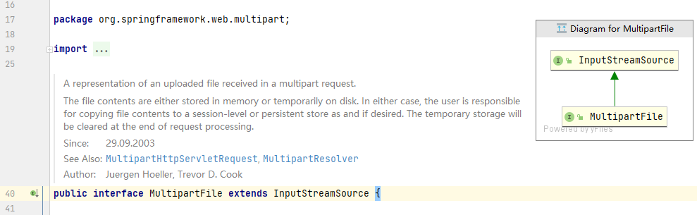
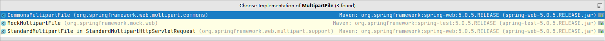
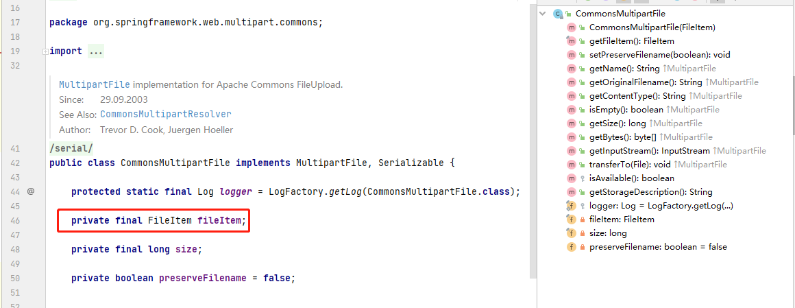
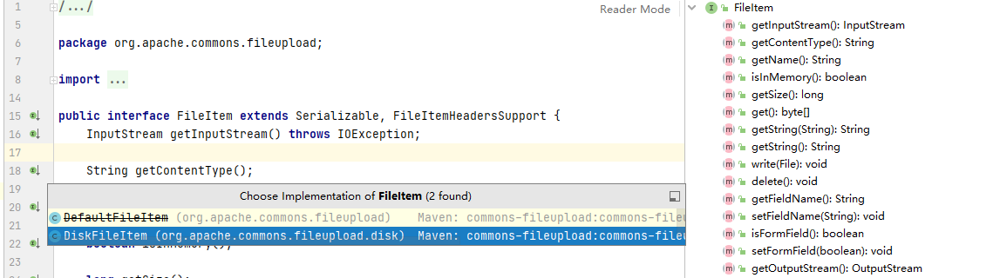
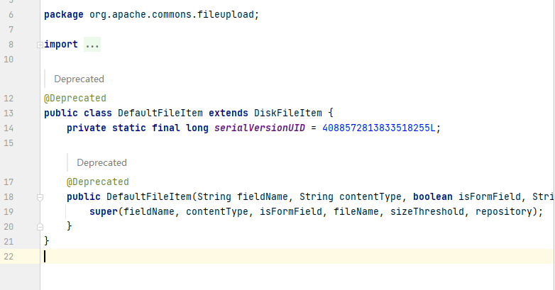
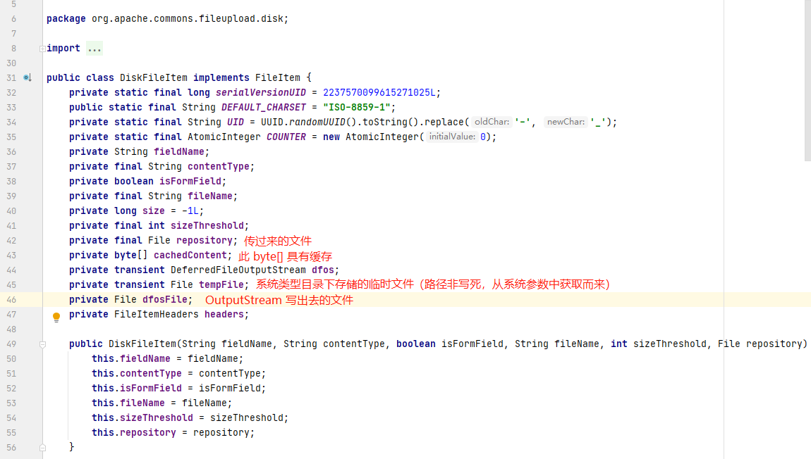

# health_parent


## 技术栈


### 后端


整体技术架构基于 ssm

分布式解决方案为 dubbo + zk

数据库为阿里云 rds

权限框架采用 spring security

批量导入基于 poi

定时任务基于 quartz

应用服务器采用基于 maven 插件形式的嵌入式 tomcat 容器

缓存中间件采用 redis

文件存储采用七牛云存储

> 为什么采用七牛云而不是阿里云？
>
> 因为 oss 之前玩过了


### 前端


整体基于 h5 + vue + elementui

静态页面使用模板引擎技术 freemarker


## 问题记录


### idea  2020.3 版本管理变动

原本窗口上方的 CVS 变成了 Git （在配置好 git 插件之后（配置之前也不是原本的 CVS））


下方的窗口也从 Version Control 变成了 Git，并且原本的窗口中有 Local change


问题：好久没有使用过 share project  on github 了，突然本次同步到 github 想用一下，查了百度和 Google 都没有 2020.3 这个问题的有效描述及解决办法，最终还是采用了现在 GitHub 建 repo 然后本地 gitbash push 的方式（轻车熟路）

```shell
Colm@SURFACE-BOOK3 MINGW64 /e/Workspaces/IdeaProjects/health_parent (master)
$ git remote add origin https://github.com/19695/health_parent.git

Colm@SURFACE-BOOK3 MINGW64 /e/Workspaces/IdeaProjects/health_parent (master)
$ git branch -M master

Colm@SURFACE-BOOK3 MINGW64 /e/Workspaces/IdeaProjects/health_parent (master)
$ git push -u origin master
Enumerating objects: 262, done.
Counting objects: 100% (262/262), done.
Delta compression using up to 8 threads
Compressing objects: 100% (191/191), done.
Writing objects: 100% (262/262), 4.06 MiB | 1.27 MiB/s, done.
Total 262 (delta 39), reused 0 (delta 0), pack-reused 0
remote: Resolving deltas: 100% (39/39), done.
To https://github.com/19695/health_parent.git
 * [new branch]      master -> master
Branch 'master' set up to track remote branch 'master' from 'origin'.
```


### git pull 异常


```
	Update failed
	unable to access 'https://github.com/19695/health_parent.git/': OpenSSL SSL_read: Connection was reset, errno 10054
```


操作记录：

```shell
Colm@SURFACE-BOOK3 MINGW64 /e/Workspaces/IdeaProjects/health_parent (master)
$ git config --global -l
user.name=19695
user.email=1969575050@qq.com
http.sslverify=false

Colm@SURFACE-BOOK3 MINGW64 /e/Workspaces/IdeaProjects/health_parent (master)
$ git pull origin master
fatal: unable to access 'https://github.com/19695/health_parent.git/': OpenSSL SSL_read: Connection was reset, errno 10054

Colm@SURFACE-BOOK3 MINGW64 /e/Workspaces/IdeaProjects/health_parent (master)
$ git config --global http.sslVerify "false"

Colm@SURFACE-BOOK3 MINGW64 /e/Workspaces/IdeaProjects/health_parent (master)
$ git config --global -l
user.name=19695
user.email=1969575050@qq.com
http.sslverify=false

Colm@SURFACE-BOOK3 MINGW64 /e/Workspaces/IdeaProjects/health_parent (master)
$ git pull origin master
remote: Enumerating objects: 4, done.
remote: Counting objects: 100% (4/4), done.
remote: Compressing objects: 100% (3/3), done.
remote: Total 3 (delta 1), reused 0 (delta 0), pack-reused 0
Unpacking objects: 100% (3/3), 1.02 KiB | 130.00 KiB/s, done.
From https://github.com/19695/health_parent
 * branch            master     -> FETCH_HEAD
   ce9a2bc..0c80952  master     -> origin/master
Updating ce9a2bc..0c80952
Fast-forward
 README.md | 22 ++++++++++++++++++++++
 1 file changed, 22 insertions(+)
 create mode 100644 README.md

```

push 的时候遇到了同样的问题


```shell
Colm@SURFACE-BOOK3 MINGW64 /e/Workspaces/IdeaProjects/health_parent (master)
$ git config --global http.sslVerify "false"

Colm@SURFACE-BOOK3 MINGW64 /e/Workspaces/IdeaProjects/health_parent (master)
$ git push origin master
fatal: unable to access 'https://github.com/19695/health_parent.git/': OpenSSL SSL_read: Connection was reset, errno 10054

```

没有起到作用，考虑将 https 替换为 git

```shell
Colm@SURFACE-BOOK3 MINGW64 /e/Workspaces/IdeaProjects/health_parent (master)
git remote -v
origin  https://github.com/19695/health_parent.git (fetch)
origin  https://github.com/19695/health_parent.git (push)

Colm@SURFACE-BOOK3 MINGW64 /e/Workspaces/IdeaProjects/health_parent (master)
$ git remote -v
origin  https://github.com/19695/health_parent.git (fetch)
origin  https://github.com/19695/health_parent.git (push)

Colm@SURFACE-BOOK3 MINGW64 /e/Workspaces/IdeaProjects/health_parent (master)
$ git remote --help

Colm@SURFACE-BOOK3 MINGW64 /e/Workspaces/IdeaProjects/health_parent (master)
$ git remote rm origin

Colm@SURFACE-BOOK3 MINGW64 /e/Workspaces/IdeaProjects/health_parent (master)
$ git remote -v

Colm@SURFACE-BOOK3 MINGW64 /e/Workspaces/IdeaProjects/health_parent (master)
$ git remote add origin git@github.com:19695/health_parent.git

Colm@SURFACE-BOOK3 MINGW64 /e/Workspaces/IdeaProjects/health_parent (master)
$ git remote -v
origin  git@github.com:19695/health_parent.git (fetch)
origin  git@github.com:19695/health_parent.git (push)

Colm@SURFACE-BOOK3 MINGW64 /e/Workspaces/IdeaProjects/health_parent (master)
$ git push origin master
The authenticity of host 'github.com (52.74.223.119)' can't be established.
RSA key fingerprint is SHA256:nThbg6kXUpJWGl7E1IGOCspRomTxdCARLviKw6E5SY8.
Are you sure you want to continue connecting (yes/no/[fingerprint])? yes
Warning: Permanently added 'github.com,52.74.223.119' (RSA) to the list of known hosts.
Enumerating objects: 9, done.
Counting objects: 100% (9/9), done.
Delta compression using up to 8 threads
Compressing objects: 100% (7/7), done.
Writing objects: 100% (7/7), 93.97 KiB | 239.00 KiB/s, done.
Total 7 (delta 1), reused 0 (delta 0), pack-reused 0
remote: Resolving deltas: 100% (1/1), completed with 1 local object.
To github.com:19695/health_parent.git
   0c80952..ec99349  master -> master

```


### mybaits 不指定 resultType

```
00:54:25,436 ERROR ExceptionFilter:84 -  [DUBBO] Got unchecked and undeclared exception which called by 192.168.31.132. service: com.colm.service.CheckGroupService, method: findCheckItemIdsByCheckGroupId, exception: org.mybatis.spring.MyBatisSystemException: nested exception is org.apache.ibatis.executor.ExecutorException: A query was run and no Result Maps were found for the Mapped Statement 'com.colm.dao.CheckGroupDao.findCheckItemIdsByCheckGroupId'.  It's likely that neither a Result Type nor a Result Map was specified., dubbo version: 2.6.0, current host: 127.0.0.1
org.mybatis.spring.MyBatisSystemException: nested exception is org.apache.ibatis.executor.ExecutorException: A query was run and no Result Maps were found for the Mapped Statement 'com.colm.dao.CheckGroupDao.findCheckItemIdsByCheckGroupId'.  It's likely that neither a Result Type nor a Result Map was specified.
	at org.mybatis.spring.MyBatisExceptionTranslator.translateExceptionIfPossible(MyBatisExceptionTranslator.java:77)
	at org.mybatis.spring.SqlSessionTemplate$SqlSessionInterceptor.invoke(SqlSessionTemplate.java:446)
	at com.sun.proxy.$Proxy39.selectList(Unknown Source)
	at org.mybatis.spring.SqlSessionTemplate.selectList(SqlSessionTemplate.java:230)
	at org.apache.ibatis.binding.MapperMethod.executeForMany(MapperMethod.java:137)
	at org.apache.ibatis.binding.MapperMethod.execute(MapperMethod.java:75)
	at org.apache.ibatis.binding.MapperProxy.invoke(MapperProxy.java:59)
	at com.sun.proxy.$Proxy43.findCheckItemIdsByCheckGroupId(Unknown Source)
	at com.colm.service.impl.CheckGroupServiceImpl.findCheckItemIdsByCheckGroupId(CheckGroupServiceImpl.java:40)
	at com.colm.service.impl.CheckGroupServiceImpl$$FastClassBySpringCGLIB$$67ae903d.invoke(<generated>)
	at org.springframework.cglib.proxy.MethodProxy.invoke(MethodProxy.java:204)
	at org.springframework.aop.framework.CglibAopProxy$CglibMethodInvocation.invokeJoinpoint(CglibAopProxy.java:747)
	at org.springframework.aop.framework.ReflectiveMethodInvocation.proceed(ReflectiveMethodInvocation.java:163)
	at org.springframework.transaction.interceptor.TransactionAspectSupport.invokeWithinTransaction(TransactionAspectSupport.java:294)
	at org.springframework.transaction.interceptor.TransactionInterceptor.invoke(TransactionInterceptor.java:98)
	at org.springframework.aop.framework.ReflectiveMethodInvocation.proceed(ReflectiveMethodInvocation.java:185)
	at org.springframework.aop.framework.CglibAopProxy$DynamicAdvisedInterceptor.intercept(CglibAopProxy.java:689)
	at com.colm.service.impl.CheckGroupServiceImpl$$EnhancerBySpringCGLIB$$ea4a68b0.findCheckItemIdsByCheckGroupId(<generated>)
	at com.alibaba.dubbo.common.bytecode.Wrapper0.invokeMethod(Wrapper0.java)
	at com.alibaba.dubbo.rpc.proxy.javassist.JavassistProxyFactory$1.doInvoke(JavassistProxyFactory.java:45)
	at com.alibaba.dubbo.rpc.proxy.AbstractProxyInvoker.invoke(AbstractProxyInvoker.java:71)
	at com.alibaba.dubbo.config.invoker.DelegateProviderMetaDataInvoker.invoke(DelegateProviderMetaDataInvoker.java:48)
	at com.alibaba.dubbo.rpc.protocol.InvokerWrapper.invoke(InvokerWrapper.java:52)
	at com.alibaba.dubbo.rpc.filter.ExceptionFilter.invoke(ExceptionFilter.java:61)
	at com.alibaba.dubbo.rpc.protocol.ProtocolFilterWrapper$1.invoke(ProtocolFilterWrapper.java:68)
	at com.alibaba.dubbo.monitor.support.MonitorFilter.invoke(MonitorFilter.java:74)
	at com.alibaba.dubbo.rpc.protocol.ProtocolFilterWrapper$1.invoke(ProtocolFilterWrapper.java:68)
	at com.alibaba.dubbo.rpc.filter.TimeoutFilter.invoke(TimeoutFilter.java:41)
	at com.alibaba.dubbo.rpc.protocol.ProtocolFilterWrapper$1.invoke(ProtocolFilterWrapper.java:68)
	at com.alibaba.dubbo.rpc.protocol.dubbo.filter.TraceFilter.invoke(TraceFilter.java:77)
	at com.alibaba.dubbo.rpc.protocol.ProtocolFilterWrapper$1.invoke(ProtocolFilterWrapper.java:68)
	at com.alibaba.dubbo.rpc.filter.ContextFilter.invoke(ContextFilter.java:71)
	at com.alibaba.dubbo.rpc.protocol.ProtocolFilterWrapper$1.invoke(ProtocolFilterWrapper.java:68)
	at com.alibaba.dubbo.rpc.filter.GenericFilter.invoke(GenericFilter.java:131)
	at com.alibaba.dubbo.rpc.protocol.ProtocolFilterWrapper$1.invoke(ProtocolFilterWrapper.java:68)
	at com.alibaba.dubbo.rpc.filter.ClassLoaderFilter.invoke(ClassLoaderFilter.java:37)
	at com.alibaba.dubbo.rpc.protocol.ProtocolFilterWrapper$1.invoke(ProtocolFilterWrapper.java:68)
	at com.alibaba.dubbo.rpc.filter.EchoFilter.invoke(EchoFilter.java:37)
	at com.alibaba.dubbo.rpc.protocol.ProtocolFilterWrapper$1.invoke(ProtocolFilterWrapper.java:68)
	at com.alibaba.dubbo.rpc.protocol.dubbo.DubboProtocol$1.reply(DubboProtocol.java:98)
	at com.alibaba.dubbo.remoting.exchange.support.header.HeaderExchangeHandler.handleRequest(HeaderExchangeHandler.java:96)
	at com.alibaba.dubbo.remoting.exchange.support.header.HeaderExchangeHandler.received(HeaderExchangeHandler.java:168)
	at com.alibaba.dubbo.remoting.transport.DecodeHandler.received(DecodeHandler.java:50)
	at com.alibaba.dubbo.remoting.transport.dispatcher.ChannelEventRunnable.run(ChannelEventRunnable.java:79)
	at java.base/java.util.concurrent.ThreadPoolExecutor.runWorker(ThreadPoolExecutor.java:1130)
	at java.base/java.util.concurrent.ThreadPoolExecutor$Worker.run(ThreadPoolExecutor.java:630)
	at java.base/java.lang.Thread.run(Thread.java:832)
Caused by: org.apache.ibatis.executor.ExecutorException: A query was run and no Result Maps were found for the Mapped Statement 'com.colm.dao.CheckGroupDao.findCheckItemIdsByCheckGroupId'.  It's likely that neither a Result Type nor a Result Map was specified.
	at org.apache.ibatis.executor.resultset.DefaultResultSetHandler.validateResultMapsCount(DefaultResultSetHandler.java:287)
	at org.apache.ibatis.executor.resultset.DefaultResultSetHandler.handleResultSets(DefaultResultSetHandler.java:189)
	at org.apache.ibatis.executor.statement.PreparedStatementHandler.query(PreparedStatementHandler.java:64)
	at org.apache.ibatis.executor.statement.RoutingStatementHandler.query(RoutingStatementHandler.java:79)
	at org.apache.ibatis.executor.SimpleExecutor.doQuery(SimpleExecutor.java:63)
	at org.apache.ibatis.executor.BaseExecutor.queryFromDatabase(BaseExecutor.java:324)
	at org.apache.ibatis.executor.BaseExecutor.query(BaseExecutor.java:156)
	at org.apache.ibatis.executor.CachingExecutor.query(CachingExecutor.java:109)
	at org.apache.ibatis.executor.CachingExecutor.query(CachingExecutor.java:83)
	at java.base/jdk.internal.reflect.NativeMethodAccessorImpl.invoke0(Native Method)
	at java.base/jdk.internal.reflect.NativeMethodAccessorImpl.invoke(NativeMethodAccessorImpl.java:64)
	at java.base/jdk.internal.reflect.DelegatingMethodAccessorImpl.invoke(DelegatingMethodAccessorImpl.java:43)
	at java.base/java.lang.reflect.Method.invoke(Method.java:564)
	at org.apache.ibatis.plugin.Invocation.proceed(Invocation.java:49)
	at com.github.pagehelper.SqlUtil._processPage(SqlUtil.java:401)
	at com.github.pagehelper.SqlUtil.processPage(SqlUtil.java:374)
	at com.github.pagehelper.PageHelper.intercept(PageHelper.java:254)
	at org.apache.ibatis.plugin.Plugin.invoke(Plugin.java:61)
	at com.sun.proxy.$Proxy52.query(Unknown Source)
	at org.apache.ibatis.session.defaults.DefaultSqlSession.selectList(DefaultSqlSession.java:148)
	at org.apache.ibatis.session.defaults.DefaultSqlSession.selectList(DefaultSqlSession.java:141)
	at java.base/jdk.internal.reflect.NativeMethodAccessorImpl.invoke0(Native Method)
	at java.base/jdk.internal.reflect.NativeMethodAccessorImpl.invoke(NativeMethodAccessorImpl.java:64)
	at java.base/jdk.internal.reflect.DelegatingMethodAccessorImpl.invoke(DelegatingMethodAccessorImpl.java:43)
	at java.base/java.lang.reflect.Method.invoke(Method.java:564)
	at org.mybatis.spring.SqlSessionTemplate$SqlSessionInterceptor.invoke(SqlSessionTemplate.java:433)
	... 45 more
00:54:32,734 DEBUG ClientCnxn:742 - Got ping response for sessionid: 0x1000008a7ff0024 after 10ms
00:54:42,750 DEBUG ClientCnxn:742 - Got ping response for sessionid: 0x1000008a7ff0024 after 10ms
00:54:52,750 DEBUG ClientCnxn:742 - Got ping response for sessionid: 0x1000008a7ff0024 after 7ms
00:55:02,758 DEBUG ClientCnxn:742 - Got ping response for sessionid: 0x1000008a7ff0024 after 8ms
00:55:12,765 DEBUG ClientCnxn:742 - Got ping response for sessionid: 0x1000008a7ff0024 after 7ms
00:55:22,779 DEBUG ClientCnxn:742 - Got ping response for sessionid: 0x1000008a7ff0024 after 10ms
00:55:28,897 DEBUG HeartBeatTask:64 -  [DUBBO] Send heartbeat to remote channel /192.168.31.132:7822, cause: The channel has no data-transmission exceeds a heartbeat period: 60000ms, dubbo version: 2.6.0, current host: 127.0.0.1
00:55:32,791 DEBUG ClientCnxn:742 - Got ping response for sessionid: 0x1000008a7ff0024 after 7ms
00:55:42,795 DEBUG ClientCnxn:742 - Got ping response for sessionid: 0x1000008a7ff0024 after 10ms
00:55:52,808 DEBUG ClientCnxn:742 - Got ping response for sessionid: 0x1000008a7ff0024 after 8ms
00:56:02,824 DEBUG ClientCnxn:742 - Got ping response for sessionid: 0x1000008a7ff0024 after 9ms
00:56:12,831 DEBUG ClientCnxn:742 - Got ping response for sessionid: 0x1000008a7ff0024 after 8ms
```

问题很明确，原因分析：直接看 mapper.xml

```xml
<select id="findById"><!-- resultType="com.colm.pojo.CheckGroup" parameterType="int">-->
    select *
    from t_checkgroup
    where id = #{groupId}
</select>

<select id="findCheckItemIdsByCheckGroupId"><!-- parameterType="int" resultType="int">-->
    select checkitem_id from t_checkgroup_checkitem where checkgroup_id = #{groupId}
</select>
```

> 我就是要试一下不指定参数类型和返回值类型会报什么异常

解决很简单，只要加上 `resultType` 即可


### dubbo 超时

```
01:14:09,954  WARN ChannelEventRunnable:81 -  [DUBBO] ChannelEventRunnable handle RECEIVED operation error, channel is NettyChannel [channel=[id: 0x628a3d63, /192.168.31.132:13509 :> /192.168.31.132:20887]], message is Request [id=1, version=2.0.0, twoway=true, event=false, broken=false, data=RpcInvocation [methodName=findById, parameterTypes=[class java.lang.Integer], arguments=[null], attachments={path=com.colm.service.CheckGroupService, input=212, dubbo=2.6.0, interface=com.colm.service.CheckGroupService, version=0.0.0, timeout=600000}]], dubbo version: 2.6.0, current host: 127.0.0.1
com.alibaba.dubbo.remoting.RemotingException: Failed to send message Response [id=1, version=2.0.0, status=20, event=false, error=null, result=RpcResult [result=null, exception=null]] to /192.168.31.132:13509, cause: null
	at com.alibaba.dubbo.remoting.transport.netty.NettyChannel.send(NettyChannel.java:106)
	at com.alibaba.dubbo.remoting.transport.AbstractPeer.send(AbstractPeer.java:52)
	at com.alibaba.dubbo.remoting.exchange.support.header.HeaderExchangeHandler.received(HeaderExchangeHandler.java:169)
	at com.alibaba.dubbo.remoting.transport.DecodeHandler.received(DecodeHandler.java:50)
	at com.alibaba.dubbo.remoting.transport.dispatcher.ChannelEventRunnable.run(ChannelEventRunnable.java:79)
	at java.base/java.util.concurrent.ThreadPoolExecutor.runWorker(ThreadPoolExecutor.java:1130)
	at java.base/java.util.concurrent.ThreadPoolExecutor$Worker.run(ThreadPoolExecutor.java:630)
	at java.base/java.lang.Thread.run(Thread.java:832)
Caused by: java.nio.channels.ClosedChannelException
	at org.jboss.netty.channel.socket.nio.NioWorker.cleanUpWriteBuffer(NioWorker.java:643)
	at org.jboss.netty.channel.socket.nio.NioWorker.writeFromUserCode(NioWorker.java:370)
	at org.jboss.netty.channel.socket.nio.NioServerSocketPipelineSink.handleAcceptedSocket(NioServerSocketPipelineSink.java:137)
	at org.jboss.netty.channel.socket.nio.NioServerSocketPipelineSink.eventSunk(NioServerSocketPipelineSink.java:76)
	at org.jboss.netty.channel.Channels.write(Channels.java:632)
	at org.jboss.netty.handler.codec.oneone.OneToOneEncoder.handleDownstream(OneToOneEncoder.java:70)
	at com.alibaba.dubbo.remoting.transport.netty.NettyHandler.writeRequested(NettyHandler.java:98)
	at org.jboss.netty.channel.Channels.write(Channels.java:611)
	at org.jboss.netty.channel.Channels.write(Channels.java:578)
	at org.jboss.netty.channel.AbstractChannel.write(AbstractChannel.java:251)
	at com.alibaba.dubbo.remoting.transport.netty.NettyChannel.send(NettyChannel.java:96)
	... 7 more
```


### 老生常谈 spring mvc 传参问题

```java
@GetMapping("/findById")
public Result findById(@RequestParam Integer groupId) {
```

> 如果形参名称对应了请求参数中的名称那么注解可不显示指定请求参数名，如：

```java
@GetMapping("/findById")
public Result findById(@RequestParam Integer id) {
```

> 或形参随便起名但指定请求参数名，如：

```java
@GetMapping("/findCheckItemIdsByCheckGroupId")
public Result findCheckItemIdsByCheckGroupId(@RequestParam("id") String groupId) {
```


### dubbo 序列化问题

完整日志

```
00:19:48,703 DEBUG getByTypeAndCode:159 - ==>  Preparing: select * from t_datadict where `type` = ? and code = ? 
00:19:48,704 DEBUG getByTypeAndCode:159 - ==> Parameters: 01(String), 0001(String)
00:19:48,718 DEBUG getByTypeAndCode:159 - <==      Total: 1
00:19:48,718 DEBUG SqlSessionUtils:186 - Releasing transactional SqlSession [org.apache.ibatis.session.defaults.DefaultSqlSession@37f37334]
00:19:48,718 DEBUG SqlSessionUtils:284 - Transaction synchronization committing SqlSession [org.apache.ibatis.session.defaults.DefaultSqlSession@37f37334]
00:19:48,719 DEBUG SqlSessionUtils:310 - Transaction synchronization deregistering SqlSession [org.apache.ibatis.session.defaults.DefaultSqlSession@37f37334]
00:19:48,719 DEBUG SqlSessionUtils:315 - Transaction synchronization closing SqlSession [org.apache.ibatis.session.defaults.DefaultSqlSession@37f37334]
00:19:48,719 DEBUG DataSourceTransactionManager:743 - Initiating transaction commit
00:19:48,719 DEBUG DataSourceTransactionManager:326 - Committing JDBC transaction on Connection [com.mysql.jdbc.JDBC4Connection@6b40b349]
00:19:48,757 DEBUG DataSourceTransactionManager:384 - Releasing JDBC Connection [com.mysql.jdbc.JDBC4Connection@6b40b349] after transaction
00:19:48,757 DEBUG DataSourceUtils:340 - Returning JDBC Connection to DataSource
00:19:48,758  WARN ExchangeCodec:310 -  [DUBBO] Fail to encode response: Response [id=19, version=2.0.0, status=20, event=false, error=null, result=RpcResult [result=DataDict{id=1, type='01', code='0001', value='setmeal.html'}, exception=null]], send bad_response info instead, cause: Serialized class com.colm.pojo.DataDict must implement java.io.Serializable, dubbo version: 2.6.0, current host: 127.0.0.1
java.lang.IllegalStateException: Serialized class com.colm.pojo.DataDict must implement java.io.Serializable
	at com.alibaba.com.caucho.hessian.io.SerializerFactory.getDefaultSerializer(SerializerFactory.java:400)
	at com.alibaba.com.caucho.hessian.io.SerializerFactory.getSerializer(SerializerFactory.java:374)
	at com.alibaba.com.caucho.hessian.io.Hessian2Output.writeObject(Hessian2Output.java:381)
	at com.alibaba.dubbo.common.serialize.support.hessian.Hessian2ObjectOutput.writeObject(Hessian2ObjectOutput.java:77)
	at com.alibaba.dubbo.rpc.protocol.dubbo.DubboCodec.encodeResponseData(DubboCodec.java:191)
	at com.alibaba.dubbo.remoting.exchange.codec.ExchangeCodec.encodeResponse(ExchangeCodec.java:274)
	at com.alibaba.dubbo.remoting.exchange.codec.ExchangeCodec.encode(ExchangeCodec.java:72)
	at com.alibaba.dubbo.rpc.protocol.dubbo.DubboCountCodec.encode(DubboCountCodec.java:37)
	at com.alibaba.dubbo.remoting.transport.netty.NettyCodecAdapter$InternalEncoder.encode(NettyCodecAdapter.java:80)
	at org.jboss.netty.handler.codec.oneone.OneToOneEncoder.handleDownstream(OneToOneEncoder.java:66)
	at org.jboss.netty.channel.DefaultChannelPipeline.sendDownstream(DefaultChannelPipeline.java:591)
	at org.jboss.netty.channel.DefaultChannelPipeline$DefaultChannelHandlerContext.sendDownstream(DefaultChannelPipeline.java:776)
	at org.jboss.netty.channel.SimpleChannelHandler.writeRequested(SimpleChannelHandler.java:304)
	at com.alibaba.dubbo.remoting.transport.netty.NettyHandler.writeRequested(NettyHandler.java:98)
	at org.jboss.netty.channel.SimpleChannelHandler.handleDownstream(SimpleChannelHandler.java:266)
	at org.jboss.netty.channel.DefaultChannelPipeline.sendDownstream(DefaultChannelPipeline.java:591)
	at org.jboss.netty.channel.DefaultChannelPipeline.sendDownstream(DefaultChannelPipeline.java:582)
	at org.jboss.netty.channel.Channels.write(Channels.java:611)
	at org.jboss.netty.channel.Channels.write(Channels.java:578)
	at org.jboss.netty.channel.AbstractChannel.write(AbstractChannel.java:251)
	at com.alibaba.dubbo.remoting.transport.netty.NettyChannel.send(NettyChannel.java:96)
	at com.alibaba.dubbo.remoting.transport.AbstractPeer.send(AbstractPeer.java:52)
	at com.alibaba.dubbo.remoting.exchange.support.header.HeaderExchangeHandler.received(HeaderExchangeHandler.java:169)
	at com.alibaba.dubbo.remoting.transport.DecodeHandler.received(DecodeHandler.java:50)
	at com.alibaba.dubbo.remoting.transport.dispatcher.ChannelEventRunnable.run(ChannelEventRunnable.java:79)
	at java.base/java.util.concurrent.ThreadPoolExecutor.runWorker(ThreadPoolExecutor.java:1130)
	at java.base/java.util.concurrent.ThreadPoolExecutor$Worker.run(ThreadPoolExecutor.java:630)
	at java.base/java.lang.Thread.run(Thread.java:832)

```

核心问题日志

```
00:19:48,758  WARN ExchangeCodec:310 -  [DUBBO] Fail to encode response: Response [id=19, version=2.0.0, status=20, event=false, error=null, result=RpcResult [result=DataDict{id=1, type='01', code='0001', value='setmeal.html'}, exception=null]], send bad_response info instead, cause: Serialized class com.colm.pojo.DataDict must implement java.io.Serializable, dubbo version: 2.6.0, current host: 127.0.0.1
java.lang.IllegalStateException: Serialized class com.colm.pojo.DataDict must implement java.io.Serializable
```

可以看出 dubbo 要求传输的数据必须实现序列化


### RDM 连接阿里云 Redis 问题

踩坑经过：我在阿里云 redis 除了默认的账号外我还新增了一个用于 java 开发的账号，win 端 RDM 连接的时候想要用 java 用户，于是我把连接信息都写上了包括 用户名 密码，然后就怎么都不通，怀疑过白名单配置不对，白名单没有及时生效，最后本地起虚机利用 redis-cli 测试，发现只可以使用默认账户登录，且在 RDM 配置连接信息的时候不需要指定用户名


### ! [rejected]  master -> master (non-fast-forward)

```shell
Colm@SURFACE-BOOK3 MINGW64 /e/Workspaces/IdeaProjects/health_parent (master)
$ git push origin master
To github.com:19695/health_parent.git
 ! [rejected]        master -> master (non-fast-forward)
error: failed to push some refs to 'github.com:19695/health_parent.git'
hint: Updates were rejected because the tip of your current branch is behind
hint: its remote counterpart. Integrate the remote changes (e.g.
hint: 'git pull ...') before pushing again.
hint: See the 'Note about fast-forwards' in 'git push --help' for details.

Colm@SURFACE-BOOK3 MINGW64 /e/Workspaces/IdeaProjects/health_parent (master)
$ git pull
There is no tracking information for the current branch.
Please specify which branch you want to merge with.
See git-pull(1) for details.

    git pull <remote> <branch>

If you wish to set tracking information for this branch you can do so with:

    git branch --set-upstream-to=origin/<branch> master

Colm@SURFACE-BOOK3 MINGW64 /e/Workspaces/IdeaProjects/health_parent (master)
$ git pull origin master
From github.com:19695/health_parent
 * branch            master     -> FETCH_HEAD
error: Your local changes to the following files would be overwritten by merge:
        README.md
Please commit your changes or stash them before you merge.
Aborting

Colm@SURFACE-BOOK3 MINGW64 /e/Workspaces/IdeaProjects/health_parent (master)
$ git branch --set-upstream-to=origin/master master
Branch 'master' set up to track remote branch 'master' from 'origin'.
```

然后 merge 远程即可

[! [rejected] master -> master (non-fast-forward)（有推荐视频）](https://blog.csdn.net/lujinjian605894472/article/details/8443403)


## 知识记录

### mybaits insert 获取主键

Q：执行 insert 之后的返回值？

A：默认会返回插入的记录数，也可以通过不同的手段使得除了返回记录数之外将我们的主键值填充到我们的实体中

填充的方式有两种

方式一：支持主键自增的数据库（如 MySQL）

```xml
<insert id="add" parameterType="EStudent" useGeneratedKeys="true" keyProperty="id">
  insert into TStudent(name, age) values(#{name}, #{age})
</insert>
```

方式二：不支持主键自增的数据库（如 Oracle）

```xml
<insert id="add" parameterType="EStudent">
  <selectKey keyProperty="id" resultType="_long" order="BEFORE">
    select CAST(RANDOM * 100000 as INTEGER) a FROM SYSTEM.SYSDUMMY1
  </selectKey>
  insert into TStudent(id, name, age) values(#{id}, #{name}, #{age})
</insert>
```

参考：https://www.cnblogs.com/jpfss/p/11629873.html

本项目使用的方式：

```xml
<insert id="add" parameterType="com.itheima.pojo.CheckGroup">
    <!--通过mybatis框架提供的selectKey标签获得自增产生的ID值-->
    <selectKey resultType="java.lang.Integer" order="AFTER" keyProperty="id">
        select LAST_INSERT_ID()
    </selectKey>
    insert into t_checkgroup(code,name,sex,helpCode,remark,attention)
    values
    (#{code},#{name},#{sex},#{helpCode},#{remark},#{attention})
</insert>
```


### MySQL 外键

* restrict方式 
    * 同no action, 都是立即检查外键约束   
    * 限制，指的是如果字表引用父表的某个字段的值，那么不允许直接删除父表的该值；

* cascade方式 
    * 在父表上update/delete记录时，同步update/delete掉子表的匹配记录 On delete cascade从mysql3.23.50开始可用; 
    * on update cascade从mysql4.0.8开始可用 
    * 级联，删除父表的某条记录，子表中引用该值的记录会自动被删除；

* No action方式 
    * 如果子表中有匹配的记录,则不允许对父表对应候选键进行update/delete操作 
    * 这个是ANSI SQL-92标准,从mysql4.0.8开始支持 
    * 无参照完整性关系，有了也不生效。

* set null方式 
    * 在父表上update/delete记录时，将子表上匹配记录的列设为null 要注意子表的外键列不能为not null On delete set null
    * 从mysql3.23.50开始可用;
    * on update set null从mysql4.0.8开始可用


### mybatis 批量 insert

方式一

```java
int setCheckGroupAssociateCheckItems(@Param("groupId") int groupId, 
                                     @Param("itemIds") List<Integer> itemIds);
```

```xml
<insert id="setCheckGroupAssociateCheckItems">
    insert into t_checkgroup_checkitem(checkgroup_id, checkitem_id) values
    <foreach collection="itemIds" separator="," item="id">
        (#{groupId}, #{id})
    </foreach>
</insert>
```

方式二

```java
void setSetmealAssociateGroup(Map<String, Object> map);
```

```xml
<insert id="setSetmealAssociateGroup" parameterType="map">
    insert into t_setmeal_checkgroup(setmeal_id, checkgroup_id) values
    <foreach collection="checkgroupIds" separator="," item="item">
        (#{setmealId}, #{item})
    </foreach>
</insert>
```

>  insert into t_setmeal_checkgroup(setmeal_id, checkgroup_id) values (?, ?) , (?, ?) , (?, ?) 
> Parameters: 17(Integer), 5(Integer), 17(Integer), 7(Integer), 17(Integer), 8(Integer)
> Updates: 3


### mybatis 模糊查询（注意数据库类型）

```xml
<select id="findByCondition" resultType="com.colm.pojo.CheckGroup">
    select * from t_checkgroup
    <if test="value != null and value != '' and value.length > 0">
        where code like concat('%', #{value}, '%')
        or name like concat('%', #{value}, '%')
        or helpCode like concat('%', #{value}, '%')
    </if>
</select>
```


### Spring 加载配置文件

有三种方式

* 通过 xml 加载 properties 文件
* 通过注解加载 properties 文件
* 通过 @PropertySource 和 @Value 来读取配置文件

详情参考： https://www.cnblogs.com/lyjing/p/8406827.html


### elementui 图片上传组件

（1）定义模型数据，用于后面上传文件的图片预览：

```javascript
imageUrl:null,//模型数据，用于上传图片完成后图片预览
```

（2）定义上传组件：

```html
<!--
  el-upload：上传组件
  action：上传的提交地址
  auto-upload：选中文件后是否自动上传
  name：上传文件的名称，服务端可以根据名称获得上传的文件对象
  show-file-list：是否显示已上传文件列表
  on-success：文件上传成功时的钩子
  before-upload：上传文件之前的钩子
-->
<el-upload
           class="avatar-uploader"
           action="/setmeal/upload.do"
           :auto-upload="autoUpload"
           name="imgFile"
           :show-file-list="false"
           :on-success="handleAvatarSuccess"
           :before-upload="beforeAvatarUpload">
  <!--用于上传图片预览-->
  
  <!--用于展示上传图标-->
  <i v-else class="el-icon-plus avatar-uploader-icon"></i>
</el-upload>
```

（3）定义对应的钩子函数：

```javascript
//文件上传成功后的钩子，response为服务端返回的值，file为当前上传的文件封装成的js对象
handleAvatarSuccess(response, file) {
  this.imageUrl = "http://pqjroc654.bkt.clouddn.com/"+response.data;
  this.$message({
    message: response.message,
    type: response.flag ? 'success' : 'error'
  });
  //设置模型数据（图片名称），后续提交ajax请求时会提交到后台最终保存到数据库
  this.formData.img = response.data;
}

//上传文件之前的钩子
beforeAvatarUpload(file) {
  const isJPG = file.type === 'image/jpeg';
  const isLt2M = file.size / 1024 / 1024 < 2;
  if (!isJPG) {
    this.$message.error('上传套餐图片只能是 JPG 格式!');
  }
  if (!isLt2M) {
    this.$message.error('上传套餐图片大小不能超过 2MB!');
  }
  return isJPG && isLt2M;
}
```


### 多对多映射

[参考之前写过的示例](https://github.com/atguigu-learning/atcrowdfunding07-member-parent/blob/master/atcrowdfunding10-member-mysql-provider/src/main/resources/mybatis/mapper/ProjectPOMapper.xml)

三级关联

`SetmealDao.xml`

```xml
<resultMap id="findByIdResultMap" type="com.colm.pojo.Setmeal" extends="baseResultMap">
    <!-- 多对多映射 -->
    <collection property="checkGroups" ofType="com.colm.pojo.CheckGroup" column="id"
                select="com.colm.dao.CheckGroupDao.findGroupsBySetmealId"></collection>
</resultMap>
```

`CheckGroupDao.xml`

```xml
<resultMap id="findByIdResultMap" type="com.colm.pojo.CheckGroup" extends="baseResultMap">
    <collection property="checkItems" ofType="com.colm.pojo.CheckItem" column="id"
                select="com.colm.dao.CheckItemDao.findItemsByGroupId"></collection>
</resultMap>
<select id="findGroupsBySetmealId" resultMap="findByIdResultMap">
    select * from t_checkgroup where id in (
    select checkgroup_id from t_setmeal_checkgroup where setmeal_id = #{setmealId}
    )
</select>
```

`CheckItemDao.xml`

```xml
<select id="findItemsByGroupId" parameterType="int" resultType="com.colm.pojo.CheckItem">
    select * from t_checkitem
    where id in (select checkitem_id from t_checkgroup_checkitem where checkgroup_id=#{id})
</select>
```


### jedisPoolConfig

Jedis连接就是连接池中JedisPool管理的资源，JedisPool保证资源在一个可控范围内，并且保障线程安全。使用合理的GenericObjectPoolConfig配置能够提升Redis的服务性能，降低资源开销。下列两表将对一些重要参数进行说明，并提供设置建议。


空闲Jedis对象检测由下列四个参数组合完成，testWhileIdle是该功能的开关。


> maxIdle实际上才是业务需要的最大连接数，maxTotal 是为了给出余量，所以 maxIdle 不要设置得过小，否则会有new Jedis（新连接）开销，而minIdle是为了控制空闲资源检测。
>
> 连接池的最佳性能是maxTotal=maxIdle，这样就避免了连接池伸缩带来的性能干扰。但如果并发量不大或者maxTotal设置过高，则会导致不必要的连接资源浪费。

参考：https://blog.csdn.net/u010648555/article/details/103858684


### MultipartFile 与 File

参考：

1. [MultipartFile与File的一些事](https://blog.csdn.net/sdut406/article/details/85647982)
2. [SpringBoot：关于MultipartFile和File不得不说的那些事](https://www.jianshu.com/p/520b1e292c52)
3. [深入理解MultipartFile，以更优雅的方式处理文件](https://blog.csdn.net/qq_36314960/article/details/104775557)

网上的资料没说透啊，自己看下吧

> 简单来说 MultipartFile 不是 File 的子类，它内部间接利用了 File 来 “持有” 文件

首先 MultipartFile 是 spring 的 org.springframework.web.multipart 包下的一个接口，该接口继承自 InputStreamSource



而他的实现类分别在 spring-web 和 spring-test 包下有找到



那就看下 CommonsMultipartFile 吧，这名一看就是责任重大



这里重点肯定是 FileItem 了（by the way 它的 log 使用的 spring-jcl）

这回是个老朋友了，刚开始学习 java web 和 spring 的时候就接触的 commons-fileupload，虽说接触早但是没研究过



可以看到它有两个实现类，可以看到 DefaultFileItem 已经弃用了，点进去的更是发现了它的巧妙之处，它完全的弃用了但是却保留了对曾经依赖它的第三方调用的支持



回到 DiskFileItem 简单的看下如何存储的文件，具体的可以看源码



仅仅是看 MultipartFile，如果想了解更多需要看 spring mvc 是怎么处理 MultipartFile 和 MultipartHttpServletRequest，深入了解可以看下前后端是如何处理的

参考：

1. [SpringMVC 处理multipart形式的数据](https://blog.csdn.net/qq_37598011/article/details/80796477)
2. [Spring 梳理-处理Multipart 请求](https://www.cnblogs.com/jiangtao1218/p/9813232.html)


### try-with-resources

原因是我在看到上面的问题示例代码中使用了 `try(...){...}catch(...){...}` 这是第一次遇到就搜索了一下

之前我们进行资源的释放都是在 `try-catch-finally` 语句块进行处理的

```java
InputStream in = null;
try{
	in = new FileInputStream(file);
}catch(Exception e){
	e.printStackTrace();
}finally{
	if(null != null){
        in.close;
    }
}
```

到了 jdk1.7 之后我们可以使用 `try-with-resources` 来处理

```java
try (InputStream in = new FileInputStream(file)) {
  
}catch(Exception e){
	e.printStackTrace();
}
```

> 这种写法会在try语句结束后自动释放，前提是这些可关闭的资源必须实现 java.lang.AutoCloseable 接口。
> 此时，就不用再finally中进行资源的释放了。
>
> 这是 jdk1.7 加入的 try-with-resources 写法，可以用来代替之前的 try-catch-finally 语句块，实现对某些资源开销大的 resource 省去写 finally 语句块释放资源的代码
>
> 例如：关闭流、断开数据库连接等等，都不在需要写 finally 语句块释放资源，try-with-resources 会自动释放 try 后面 () 内占用的资源


### idea 编译器的骚操作之 ≠

原因同样是因为我在研究 MultipartFile，具体是我在看它的实现类源码的时候发现如下


> if (pos ≠ -1)  {

我原本以为这是 jdk 什么版本开始的新特性，然后百度：这是 **Reader Mode** 下的 **Font ligatures** 默认勾选的效果

> 路径：Preferences > Editor > Reader Mode > Font ligatures

参考：[卧槽！Java 中的 xx ≠ null 是什么新语法？](https://javastack.blog.csdn.net/article/details/118107000)


### Java 大数常用类

* BigInteger
* BigDecimal

不管是整数型还是浮点型，它们的表示范围和精度都是有限的。JAVA中有两个用于表示大数值的类BigInteger和BigDecimal，可以表示任意长度、任意精度。当整数跟浮点数的取值范围或精度不能满足要求时，就需要用更大或者精度更高的类型BigInteger和BigDecimal了

| 枚举项      | 解释                                                         |
| ----------- | ------------------------------------------------------------ |
| UP          | 舍入远离零的舍入模式。 在丢弃非零部分之前始终增加数字(始终对非零舍弃部分前面的数字加1)。 此舍入模式始终不会减少计算值的大小。 |
| DOWN        | 接近零的舍入模式。 在丢弃某部分之前始终不增加数字(从不对舍弃部分前面的数字加1，即截断)。 此舍入模式始终不会增加计算值的大小。 |
| CEILING     | 接近正无穷大的舍入模式。 如果 BigDecimal 为正，则舍入行为与 UP 相同。 如果为负，则舍入行为与 DOWN 相同。 此舍入模式始终不会减少计算值。 |
| FLOOR       | 接近负无穷大的舍入模式。 如果 BigDecimal 为正，则舍入行为与 DOWN 相同。 如果为负，则舍入行为与 UP 相同。 此舍入模式始终不会增加计算值。 |
| HALF_UP     | 向“最接近的”数字舍入，如果与两个相邻数字的距离相等，则为向上舍入。 如果舍弃部分 >= 0.5，则舍入行为与 UP 相同;否则舍入行为与 ROUND_DOWN 相同。(四舍五入)。 |
| HALF_DOWN   | 向”最接近的”数字舍入，如果与两个相邻数字的距离相等，则向下舍入。 如果舍弃部分 > 0.5，则舍入行为与 UP 相同;否则舍入行为与 DOWN 相同(五舍六入)。 |
| HALF_EVEN   | 向“最接近的”数字舍入，如果与两个相邻数字的距离相等，则向相邻的偶数舍入。 如果舍弃部分左边的数字为奇数，则舍入行为与 HALF_UP 相同; 如果为偶数，则舍入行为与 HALF_DOWN 相同。 在重复进行一系列计算时，此舍入模式可以将累加错误减到最小。 此舍入模式也称为“银行家舍入法”，主要在美国使用。四舍六入，五分两种情况。 如果前一位为奇数，则入位，否则舍去。 以下例子为保留小数点1位，那么这种舍入方式下的结果。 1.15>1.2 1.25>1.2 |
| UNNECESSARY | 用于断言请求的操作具有精确结果的舍入模式，因此不需要舍入。 如果对获得精确结果的操作指定此舍入模式，则抛出ArithmeticException。 |

参考：https://blog.csdn.net/bupa900318/article/details/80330426

以下摘抄自 jdk15 javadoc

| Input Number | UP   | DOWN | CEILING | FLOOR | HLF_UP | hALF_DOWN | HALF_EVEN | UNNECESSARY               |
| ------------ | ---- | ---- | ------- | ----- | ------ | --------- | --------- | ------------------------- |
| 5.5          | 6    | 5    | 6       | 5     | 6      | 5         | 6         | throw ArithmeticException |
| 2.5          | 3    | 2    | 3       | 2     | 3      | 2         | 2         | throw ArithmeticException |
| 1.6          | 2    | 1    | 2       | 1     | 2      | 2         | 2         | throw ArithmeticException |
| 1.1          | 2    | 1    | 2       | 1     | 1      | 1         | 1         | throw ArithmeticException |
| 1.0          | 1    | 1    | 1       | 1     | 1      | 1         | 1         | 1                         |
| -1.0         | -1   | -1   | -1      | -1    | -1     | -1        | -1        | -1                        |
| -1.1         | -2   | -1   | -1      | -2    | -1     | -1        | -1        | throw ArithmeticException |
| -1.6         | -2   | -1   | -1      | -2    | -2     | -2        | -2        | throw ArithmeticException |
| -2.5         | -3   | -2   | -2      | -3    | -3     | -2        | -2        | throw ArithmeticException |
| -5.5         | -6   | -5   | -5      | -6    | -6     | -5        | -6        | throw ArithmeticException |

另外在 jdk9 之前 Rounding Modes（舍入模式）使用的是 BigDecimal 中声明的常量来设置，而在 jdk9 之后类中的常量被弃用了，改为使用 java.math.RoundingMode枚举类

```java
/**
Rounding mode to round away from zero. Always increments the digit prior to a nonzero discarded fraction. Note that this rounding mode never decreases the magnitude of the calculated value.
Deprecated
Use RoundingMode.UP instead.
*/    
@Deprecated(since="9")
public static final int ROUND_UP =           0;
```


### Springboot 中的文件上传

参考：[Spring Boot教程(十三)：Spring Boot文件上传](https://blog.csdn.net/gnail_oug/article/details/80324120)

* 单文件上传

```java
@PostMapping("/upload")
@ResponseBody
public String upload(@RequestParam("file") MultipartFile file) {
    ...
}
```


* 多文件上传
    * 方式一：声明 MultipartFile 数组
        我们在使用 MultipartFile 作为参数传递的时候，可以将 MultipartFile 声明为一个数组，这样就能支持多文件传输
        参考上面的文章：[深入理解MultipartFile，以更优雅的方式处理文件](https://blog.csdn.net/qq_36314960/article/details/104775557)
    * 方式二：

```java
@PostMapping("/multiUpload")
@ResponseBody
public String multiUpload(HttpServletRequest request) {
    List<MultipartFile> files = ((MultipartHttpServletRequest) request).getFiles("file");
    ...
}
```

